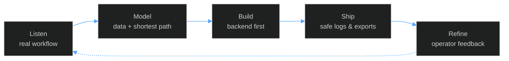

<div align="center">


<a href="https://adrianwahyuseptianto.vercel.app"></a>
<a href="https://linkedin.com/in/adrian-wahyu-septianto"></a>
<a href="mailto:adrianwahyuseptianto1@gmail.com"></a>
<a href="https://t.me/adrcwy"></a>


</div>


```console
adrcwy@github:~$ whoami --verbose

name        Adrian Wahyu Septianto
role        Full Stack Developer
based       Surabaya, Indonesia (UTC+7)
focus       request-driven internal systems
languages   English / Bahasa Indonesia
open to     remote · hybrid · freelance
```

I build software that starts as a real request from real people, not a feature list. Most of it
lives inside companies: operational dashboards, automation that removes manual steps, and data
pipelines that end in something a manager can actually read.

I care about clean data models, honest logging, and handoffs that don't break after I leave.

<br clear="right" />

<div align="center">


</div>

<table>
<tr>
<td width="33%" valign="top">

**Internal tools**

Operational dashboards, reporting surfaces, and monitoring built around an existing workflow.

</td>
<td width="33%" valign="top">

**Automation**

Scheduled jobs, messaging flows, and spreadsheet exports that remove repetitive manual work.

</td>
<td width="33%" valign="top">

**Data collection**

Crawlers and structured datasets, including network-analysis exports ready for Gephi.

</td>
</tr>
<tr>
<td width="33%" valign="top">

**Web platforms**

Laravel and Next.js applications with secure headers, SEO utilities, and a clean asset pipeline.

</td>
<td width="33%" valign="top">

**Cross-platform mobile**

Expo / React Native apps backed by custom APIs and offline-tolerant local storage.

</td>
<td width="33%" valign="top">

**Bots &amp; integrations**

Discord commerce bots, webhooks, and service glue between tools that were never meant to talk.

</td>
</tr>
</table>

<div align="center">


<br>

<br>


</div>

<details>
<summary><b>Detailed breakdown</b></summary>
<br>

| Layer | Tools |
|:--|:--|
| **Languages** | TypeScript, JavaScript, PHP, SQL, Lua |
| **Frontend** | Next.js, React, React Native (Expo), Tailwind CSS |
| **Backend** | Node.js, Express, Laravel, Socket.IO |
| **Realtime** | Socket.IO, webhooks, scheduled workers |
| **Data** | SQLite, MySQL, MongoDB, Firebase |
| **Delivery** | Git, Linux, VPS, Vercel, Vite, Postman |

</details>

<div align="center">


</div>

<table>
<tr>
<td width="50%" valign="top">

**Company Office Suite** <br>
<sub>`EXPO` `REACT` `EXPRESS` `SQLITE`</sub>

Mobile app plus web admin for office workflows: reporting, QR utilities, maps, exports, and sync.

</td>
<td width="50%" valign="top">

**Company Tools Hub** <br>
<sub>`NODE` `SOCKET.IO` `AUTOMATION`</sub>

Operations hub for procurement snapshots, sales logs, messaging automation, and scheduled jobs.

</td>
</tr>
<tr>
<td width="50%" valign="top">

**Twitter SNA Scraper** <br>
<sub>`NODE` `EXPRESS` `CSV` `GEPHI`</sub>

Crawler and dashboard for social network analysis, exporting nodes and edges for graph tooling.

</td>
<td width="50%" valign="top">

**Auto Store v2** <br>
<sub>`DISCORD.JS` `MONGODB` `EXPRESS`</sub>

Discord commerce bot with slash commands, balance flow, inventory, top-up webhooks, web admin.

</td>
</tr>
<tr>
<td width="50%" valign="top">

**Company Website** <br>
<sub>`LARAVEL` `PHP` `TAILWIND` `VITE`</sub>

Laravel platform with secure headers, sitemap utilities, and a crawler package for internal SEO.

</td>
<td width="50%" valign="top">

**Proxy Seller Panel** <br>
<sub>`NODE` `LINUX` `SHELL`</sub>

VPS tooling and dashboard for provisioning, monitoring, and maintaining proxy nodes.

</td>
</tr>
</table>

<div align="center">
<a href="https://github.com/adrcwy/developer-portfolio">
  
</a>


</div>



<div align="center">


</div>
